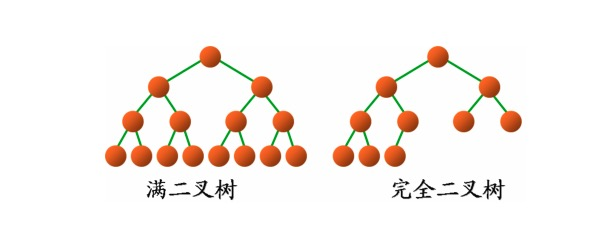
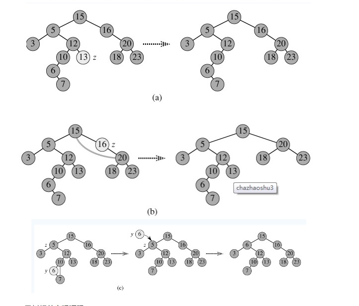
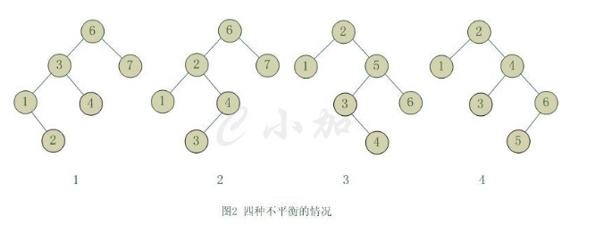
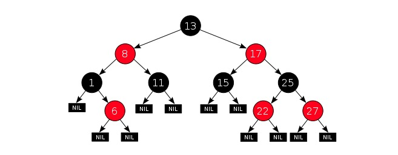
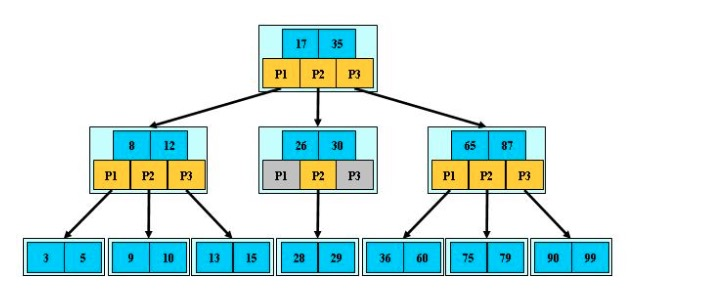
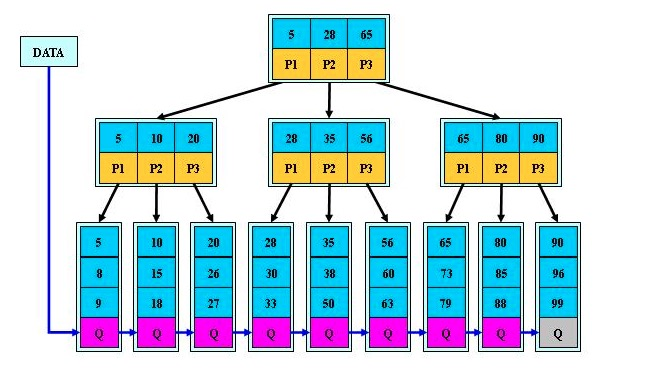
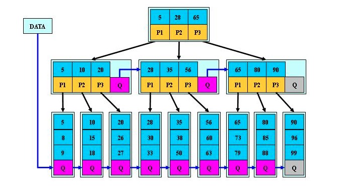

## 哈弗曼树/霍夫曼树 huffman
* 路径：从一个祖先结点到子孙结点之间的分支构成这两个结点间的路径；
* 路径长度：路径上的分支数目称为路径长度；
* 树的路径长度：从根到每个结点的路径长度之和。
* 结点的权：根据应用的需要可以给树的结点赋权值；
* 结点的带权路径长度：从根到该结点的路径长度与该结点权的乘积；
* 树的带权路径长度=树中所有叶子结点的带权路径之和；通常记作 WPL=∑wi×li
* 哈夫曼树：假设有n个权值(w1, w2, … , wn)，构造有n个叶子结点的二叉树，每个叶子结点有一个 wi作为它的权值。则带权路径长度最小的二叉树称为哈夫曼树。最优二叉树。

## 满二叉树和完全二叉树
* 满二叉树的性质：
    1) 一颗树深度为h，最大层数为k，深度与最大层数相同，k=h;
    2) 叶子数为2h;
    3) 第k层的结点数是：2k-1;
    4) 总结点数是：2k-1，且总节点数一定是奇数。
* 完全二叉树：若设二叉树的深度为h，除第 h 层外，其它各层 (1～(h-1)层) 的结点数都达到最大个数，第h层所有的结点都连续集中在最左边，这就是完全二叉树。

## 二叉查找树
* 二叉查找树定义：又称为是二叉排序树（Binary Sort Tree）或二叉搜索树。二叉排序树或者是一棵空树，或者是具有下列性质的二叉树：
    1) 若左子树不空，则左子树上所有结点的值均小于它的根结点的值；
    2) 若右子树不空，则右子树上所有结点的值均大于或等于它的根结点的值；
    3) 左、右子树也分别为二叉排序树；
    4) 没有键值相等的节点。
* 二叉查找树的性质：对二叉查找树进行中序遍历，即可得到有序的数列。
* 二叉查找树的时间复杂度：它和二分查找一样，插入和查找的时间复杂度均为O(logn)，但是在最坏的情况下仍然会有O(n)的时间复杂度。原因在于插入和删除元素的时候，树没有保持平衡（比如，我们查找上图（b）中的“93”，我们需要进行n次查找操作）。我们追求的是在最坏的情况下仍然有较好的时间复杂度，这就是平衡查找树设计的初衷
* 二叉查找树的高度决定了二叉查找树的查找效率
* 二叉查找树的插入过程如下：
    1) 若当前的二叉查找树为空，则插入的元素为根节点;
    2) 若插入的元素值小于根节点值，则将元素插入到左子树中;
    3) 若插入的元素值不小于根节点值，则将元素插入到右子树中。

* 二叉查找树的删除，分三种情况进行处理：
    1) p为叶子节点，直接删除该节点，再修改其父节点的指针（注意分是根节点和不是根节点），如图a;
    2) p为单支节点（即只有左子树或右子树）。让p的子树与p的父亲节点相连，删除p即可（注意分是根节点和不是根节点），如图b;
    3) p的左子树和右子树均不空。找到p的后继y，因为y一定没有左子树，所以可以删除y，并让y的父亲节点成为y的右子树的父亲节点，并用y的值代替p的值；或者方法二是找到p的前驱x，x一定没有右子树，所以可以删除x，并让x的父亲节点成为y的左子树的父亲节点。如图c。

## 平衡二叉树
* 平衡二叉树定义：平衡二叉树（Balanced Binary Tree）又被称为AVL树（有别于AVL算法），且具有以下性质：它是一 棵空树或它的左右两个子树的高度差的绝对值不超过1，并且左右两个子树都是一棵平衡二叉树。平衡二叉树的常用算法有红黑树、AVL树等。在平衡二叉搜索树中，我们可以看到，其高度一般都良好地维持在O(log2n)，大大降低了操作的时间复杂度。 
* 最小二叉平衡树的节点的公式如下：
    F(n)=F(n-1)+F(n-2)+1; 
    这个类似于一个递归的数列，可以参考Fibonacci数列，1是根节点，F(n-1)是左子树的节点数量，F(n-2)是右子树的节点数量
### 平衡查找树之AVL树
AVL树定义：AVL树是最先发明的自平衡二叉查找树。在AVL中任何节点的两个儿子子树的高度最大差别为1，所以它也被称为高度平衡树，n个结点的AVL树最大深度约1.44log2n。查找、插入和删除在平均和最坏情况下都是O(logn)。增加和删除可能需要通过一次或多次树旋转来重新平衡这个树
* AVL树的自平衡操作——旋转
    1) 6节点的左子树3节点高度比右子树7节点大2，左子树3节点的左子树1节点高度大于右子树4节点，这种情况成为左左。
    2) 6节点的左子树2节点高度比右子树7节点大2，左子树2节点的左子树1节点高度小于右子树4节点，这种情况成为左右。
    3) 2节点的左子树1节点高度比右子树5节点小2，右子树5节点的左子树3节点高度大于右子树6节点，这种情况成为右左。
    4) 2节点的左子树1节点高度比右子树4节点小2，右子树4节点的左子树3节点高度小于右子树6节点，这种情况成为右右。
    从图2中可以可以看出，1和4两种情况是对称的，这两种情况的旋转算法是一致的，只需要经过一次旋转就可以达到目标，我们称之为单旋转。2和3两种情况也是对称的，这两种情况的旋转算法也是一致的，需要进行两次旋转，我们称之为双旋转。

### 平衡二叉树之红黑树
红黑树的定义：红黑树是一种自平衡二叉查找树，是在计算机科学中用到的一种数据结构，典型的用途是实现关联数组
性质1. 节点是红色或黑色。
性质2. 根是黑色。
性质3. 所有叶子都是黑色（叶子是NIL节点）。
性质4. 每个红色节点必须有两个黑色的子节点。(从每个叶子到根的所有路径上不能有两个连续的红色节点。)
性质5. 从任一节点到其每个叶子的所有简单路径都包含相同数目的黑色节点。

## B树
B树也是一种用于查找的平衡树，但是它不是二叉树。
B树的定义：B树（B-tree）是一种树状数据结构，能够用来存储排序后的数据。这种数据结构能够让查找数据、循序存取、插入数据及删除的动作，都在对数时间内完成。B树，概括来说是一个一般化的二叉查找树，可以拥有多于2个子节点。与自平衡二叉查找树不同，B-树为系统最优化大块数据的读和写操作。B-tree算法减少定位记录时所经历的中间过程，从而加快存取速度。这种数据结构常被应用在数据库和文件系统的实作上。
* B树作为一种多路搜索树（并不是二叉的）：
    1) 定义任意非叶子结点最多只有M个儿子；且M>2；
    2) 根结点的儿子数为[2, M]；
    3) 除根结点以外的非叶子结点的儿子数为[M/2, M]；
    4) 每个结点存放至少M/2-1（取上整）和至多M-1个关键字；（至少2个关键字）
    5) 非叶子结点的关键字个数=指向儿子的指针个数-1；
    6) 非叶子结点的关键字：K[1], K[2], …, K[M-1]；且K[i] < K[i+1]；
    7) 非叶子结点的指针：P[1], P[2], …, P[M]；其中P[1]指向关键字小于K[1]的子树，P[M]指向关键字大于K[M-1]的子树，其它P[i]指向关键字属于(K[i-1], K[i])的子树；
    8) 所有叶子结点位于同一层；

如下图为一个M=3的B树示例：

## B+树
* B+树是B树的变体，也是一种多路搜索树：
    1) 其定义基本与B-树相同，除了：
    2) 非叶子结点的子树指针与关键字个数相同；
    3) 非叶子结点的子树指针P[i]，指向关键字值属于[K[i], K[i+1])的子树（B-树是开区间）；
    4) 为所有叶子结点增加一个链指针；
    5) 所有关键字都在叶子结点出现；

* B+树的搜索与B树也基本相同，区别是B+树只有达到叶子结点才命中（B树可以在非叶子结点命中），其性能也等价于在关键字全集做一次二分查找；
    B+的性质：
    1.所有关键字都出现在叶子结点的链表中（稠密索引），且链表中的关键字恰好是有序的；
    2.不可能在非叶子结点命中；
    3.非叶子结点相当于是叶子结点的索引（稀疏索引），叶子结点相当于是存储（关键字）数据的数据层；
    4.更适合文件索引系统。

下图为M=3的B+树的示意图：

## B*树
B*树是B+树的变体，在B+树的非根和非叶子结点再增加指向兄弟的指针，将结点的最低利用率从1/2提高到2/3。

* B*树定义了非叶子结点关键字个数至少为 (2/3) x M，即块的最低使用率为2/3（代替B+树的1/2）；
* B+树的分裂：当一个结点满时，分配一个新的结点，并将原结点中1/2的数据复制到新结点，最后在父结点中增加新结点的指针；B+树的分裂只影响原结点和父结点，而不会影响兄弟结点，所以它不需要指向兄弟的指针；
* B*树的分裂：当一个结点满时，如果它的下一个兄弟结点未满，那么将一部分数据移到兄弟结点中，再在原结点插入关键字，最后修改父结点中兄弟结点的关键字（因为兄弟结点的关键字范围改变了）；如果兄弟也满了，则在原结点与兄弟结点之间增加新结点，并各复制1/3的数据到新结点，最后在父结点增加新结点的指针；

所以，B*树分配新结点的概率比B+树要低，空间使用率更高

## Trie树
* Tire树称为字典树，又称单词查找树，Trie树，是一种树形结构，是一种哈希树的变种。典型应用是用于统计，排序和保存大量的字符串（但不仅限于字符串），所以经常被搜索引擎系统用于文本词频统计。它的优点是：利用字符串的公共前缀来减少查询时间，最大限度地减少无谓的字符串比较，查询效率比哈希树高。

* Tire树的三个基本性质：
    1) 根节点不包含字符，除根节点外每一个节点都只包含一个字符；
    2) 从根节点到某一节点，路径上经过的字符连接起来，为该节点对应的字符串；
    3) 每个节点的所有子节点包含的字符都不相同。
* Tire树的应用：
    1) 串的快速检索
    给出N个单词组成的熟词表，以及一篇全用小写英文书写的文章，请你按最早出现的顺序写出所有不在熟词表中的生词。在这道题中，我们可以用数组枚举，用哈希，用字典树，先把熟词建一棵树，然后读入文章进行比较，这种方法效率是比较高的。
    2) “串”排序
    给定N个互不相同的仅由一个单词构成的英文名，让你将他们按字典序从小到大输出。用字典树进行排序，采用数组的方式创建字典树，这棵树的每个结点的所有儿子很显然地按照其字母大小排序。对这棵树进行先序遍历即可。
    3) 最长公共前缀
    对所有串建立字典树，对于两个串的最长公共前缀的长度即他们所在的结点的公共祖先个数，于是，问题就转化为求公共祖先的问题。

